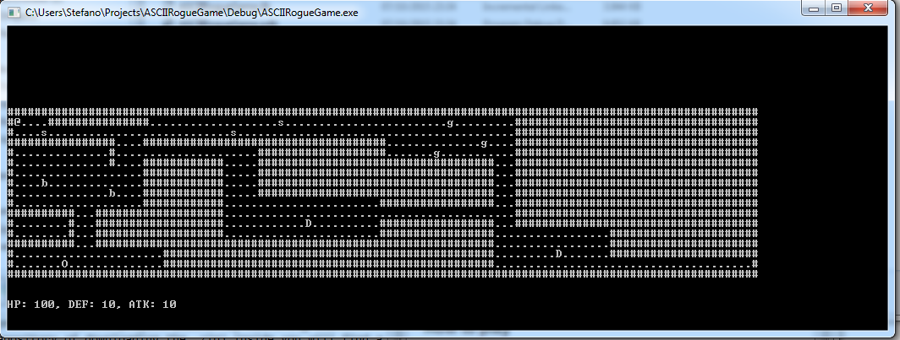
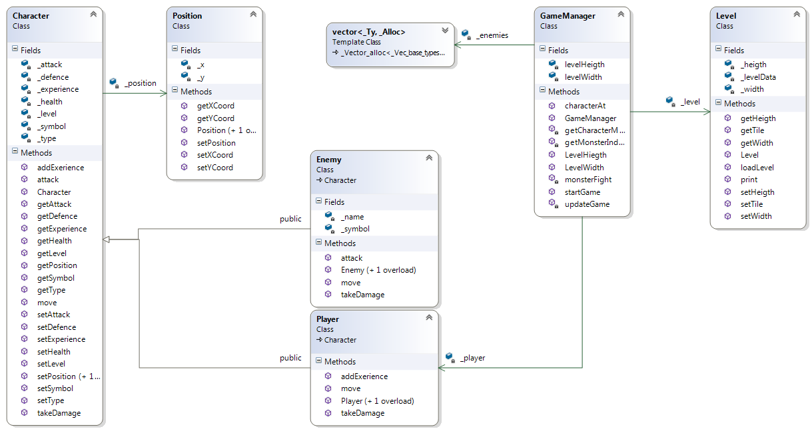

## Simple ASCII rogue like engine ##

This is a simple **engine** written in C++ to create rogue like games. The engine read simple ASCII text file to load the map and at the moment there only these types of monster:

- D - are dragons
- O - are ogres
- g - are goblins
- s - are snakes
- b - are bandits

All the monsters have the same type of AI: if the player in near "enough" then they will chase him to death, otherwise they will move randomly on the map.

### How to play ###

First download the project (either by clonining the repository of downloading the .zip) inside you will find a '\Debug' folder with a .exe and the default map a .txt file.

The player can move with 'wasd' key and can engage in battle monster simply moving on them. When the player kill a monster he will gain a certain amount of exp based on the type of monster.

### Code structure ###

The is written so that it can be further expanded with new features. All the classes are loosly coupled and every module does only a specific thing.

#### Class diagram ####

